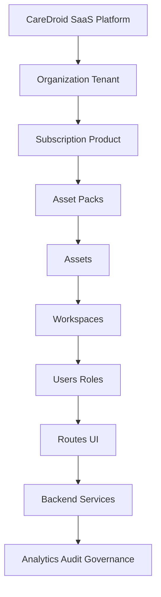

# SaaS Refactor And Mounting Report

## 1. Executive Summary

CareDroid has been mounted into a clearer SaaS graph without deleting existing capabilities. The backend platform asset/product catalog remains the commercial entitlement source, while the frontend now projects every user-facing tool into a mounted asset record with product, pack, workspace, role, route, execution, lifecycle, demo/live, and governance metadata.

The primary implementation files are:

- `src/data/assetInventory.js`
- `src/config/routes.config.js`
- `src/config/backendApiCapabilities.js`
- `src/pages/PlatformOSPages.jsx`
- `src/data/saasComplianceAudit.js`
- `src/data/duplicateSystemAudit.js`

## 2. What Was Dismantled Or Scattered

The investigation found several overlapping systems:

- Routes lived in `App.jsx`, `routes.config.js`, route aliases, navigation config, workspace shortcuts, and launch contracts.
- Tool identity was spread across `toolRegistry.js`, `toolInventory.js`, `clinicalIntentToolCatalog.js`, calculator manifests, NLU IDs, and backend executor registries.
- SaaS packaging existed in backend `platform_assets`, `asset_packs`, product catalog seeds, frontend entitlement config, and marketplace-style pages.
- Asset projection existed, but `src/data/assetInventory.js` previously emitted empty `packIds`, which left frontend assets floating from a SaaS perspective.
- Backend exposure was mostly documented, but `platformAssets` was missing from frontend backend capability status.

## 3. New SaaS Layer Architecture

The mounted frontend projection now follows this chain:

`buildAssetInventoryProjection()` now produces the frontend asset graph. Each projected asset includes:

- `productIds`
- `packIds`
- `workspaceIds`
- `roleIds`
- `layers`
- `commercial`
- `access`
- `execution`
- `governance`
- `mounting`
- `evidence`

## 4. Feature-To-Layer Mapping

Representative mappings now covered by tests:

| Capability | Asset Layer | Pack Layer | Product Layer | Workspace/Role Layer |
| --- | --- | --- | --- | --- |
| qSOFA | `qsofa` | `emergency-medicine` | `product-emergency-department` | Emergency clinicians |
| Hospital Map | `hospital-map` route/capability | `hospital-operations`, `digital-twin-pack` | `product-hospital-operations` | Operations/admin |
| Medical IoT | IoT/device assets | `medical-iot-pack` | `product-medical-iot` | Biomedical/operations |
| Simulation Suite | `simulation-suite` | `simulation-training-pack` | `product-simulation-training` | Education/clinical |
| Clinical Audit | `clinical-audit` | `governance-compliance-pack` | `product-governance` | Admin/governance |

## 5. Route Normalization

`src/config/routes.config.js` now includes canonical SaaS and operations records for routes that were already rendered in `App.jsx` but missing from `ROUTE_RECORDS`:

- `/digital-twin`
- `/operations-center`
- `/hospital-map`
- `/medical-iot`
- `/devices`
- `/fleet/command`
- `/organization`
- `/platform-analytics`
- `/products`
- `/plans`
- `/specialties`
- `/care-pathways`
- `/agents`
- `/maturity-assessment`
- `/outcomes`
- `/integrations-marketplace`
- `/configuration-studio`

`buildRouteOwnershipProjection()` verifies every route record is either asset-owned or explicitly system/admin/product owned.

## 6. Inventory Normalization

`src/data/assetInventory.js` is now the mounted frontend projection layer. It uses:

- `toolInventory.js` for launch/source inventory.
- `profileToolSegmentation.js` for role/workspace/permission segmentation.
- `assetEntitlements.js` and platform context for entitlement filtering.
- Local SaaS product and pack metadata as offline/demo projection fallback.

Legacy tool, calculator, assistant, and workspace projections are not deleted. They are treated as compatibility and launch sources feeding the mounted asset graph.

## 7. Product/Pack/Asset Mapping

The frontend projection declares product and pack taxonomies aligned to backend seed intent:

- Emergency Flow Intelligence Platform
- Hospital Operations Solution
- ICU Suite
- Cardiology Suite
- Laboratory Intelligence Suite
- Medical IoT Solution
- Fleet & EMS Suite
- Digital Twin Suite
- Simulation & Training Solution
- Governance & Compliance Solution
- Research & Education Solution

Every projected user-facing asset now has at least one `packId` and one `productId`.

## 8. Backend/Frontend Wiring

Each mounted asset now has an honest `execution.supportStatus`:

- `backend-backed`
- `local-deterministic`
- `ai-assisted`
- `demo-only`
- `unsupported`

`src/config/backendApiCapabilities.js` now includes `platformAssets`, so platform asset endpoints are classified instead of showing as unknown capability keys.

The asset library UI now displays execution/demo status and product/pack metadata instead of only lifecycle and entitlement state.

## 9. UX Cleanup

The app continues to use:

- One `AppShell`.
- One `Sidebar`.
- One authenticated header.
- One primary scroll model.
- Quick command for broad launch access.
- Sidebar for narrower primary/solution/operations/advanced navigation.

Existing `AppShell.layout.test.js` verifies there is no bottom navigation conflict with the sidebar drawer model.

## 10. Tests Added Or Updated

Added:

- `src/data/assetInventory.test.js`

Updated:

- `src/data/saasComplianceAudit.report.test.js`

Verified focused suite:

- `src/data/assetInventory.test.js`
- `src/data/saasComplianceAudit.report.test.js`
- `src/config/canonicalConfig.contract.test.js`
- `src/layout/AppShell.layout.test.js`
- `src/data/backendFrontendExposure.test.js`

## 11. Remaining Risks

- Backend seed generation is still manual. The frontend projection is mounted, but a future task should generate or validate backend seed rows directly from the canonical launch inventory.
- Some commercial/system routes are documented as system/product surfaces rather than launchable assets. If they become launchable, they should receive explicit asset rows.
- Full validation still depends on broad frontend/backend test, lint, and production build runs.
