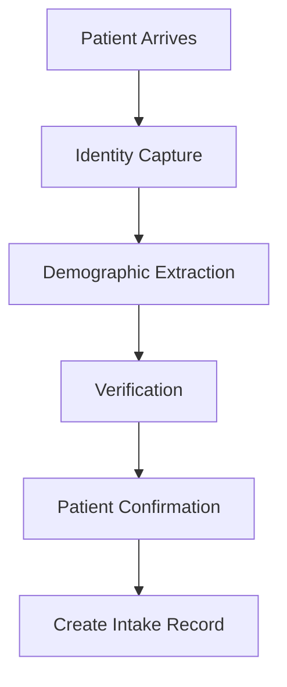

# Smart Patient Intake Engine

## Goal

Reduce registration and intake burden by turning patient intake into an assisted workflow instead of a fully manual data entry process.

The engine captures identity and administrative information from available sources, extracts likely patient fields, and presents them for human or patient confirmation before creating the intake record.

## Intake Workflow

## Capture Scope

The intake engine should assist with capture of:

- Name
- Date of birth
- Address
- Phone
- Emergency contact
- Identifiers
- Insurance metadata, when available

Identifiers may include medical record number, government ID reference, visit identifier, or other facility-approved registration identifiers. Insurance metadata may include payer name, plan label, member identifier, group identifier, and coverage hints when those fields are available from the intake source.

## Extraction And Verification

The engine may extract intake fields from scanned documents, patient-entered forms, registration kiosks, integration payloads, prior visit context, or other approved administrative sources.

Extracted values should be treated as proposed values, not confirmed truth:

- Every extracted field must show its source when available.
- Every extracted field must be editable before submission.
- Every extracted field must have a confirmation state.
- Conflicting values must be highlighted for review.
- Missing required values must remain visible as unresolved intake work.

## Confirmation Rule

All extracted fields require human or patient confirmation before they can be written into the intake record.

The system may prefill suggested values, but it must not silently finalize demographics, contact details, identifiers, or insurance metadata without confirmation. Confirmation can be completed by registration staff, the patient, or an approved representative depending on the intake setting.

## Intake Record Contract

The created intake record should preserve:

- Confirmed patient identity fields.
- Confirmed demographic and contact fields.
- Confirmed emergency contact fields.
- Confirmed identifiers.
- Confirmed insurance metadata when available.
- Field-level confirmation status.
- Field-level source metadata when available.
- Reviewer or patient confirmation attribution.
- Timestamp of confirmation.

Unconfirmed values may remain attached as draft suggestions or review notes, but they should not be promoted to the confirmed intake record.

## Workspace Behavior

The intake experience should make registration staff faster without removing accountability:

- The patient arrives and identity capture begins from available documents, forms, or integration data.
- The system extracts likely demographic, contact, identifier, and insurance fields.
- Staff or the patient reviews extracted values in a verification step.
- The patient confirms the final values or staff records confirmation on the patient's behalf.
- The system creates the intake record only from confirmed fields.

## Safety And Privacy Boundary

The Smart Patient Intake Engine is an administrative intake assistant. It does not diagnose, triage, assign acuity, determine eligibility, authorize coverage, or make clinical decisions.

Because the workflow handles sensitive identity, demographic, contact, and insurance information, it should preserve auditability, role-appropriate access, and clear attribution for every confirmed field.

## Acceptance

The Smart Patient Intake Engine is ready when:

- Patient intake becomes assisted rather than manual.
- The workflow follows Patient Arrives, Identity Capture, Demographic Extraction, Verification, Patient Confirmation, and Create Intake Record.
- Name, DOB, address, phone, emergency contact, identifiers, and insurance metadata when available are supported capture fields.
- Every extracted field requires human or patient confirmation.
- The created intake record only promotes confirmed values.
