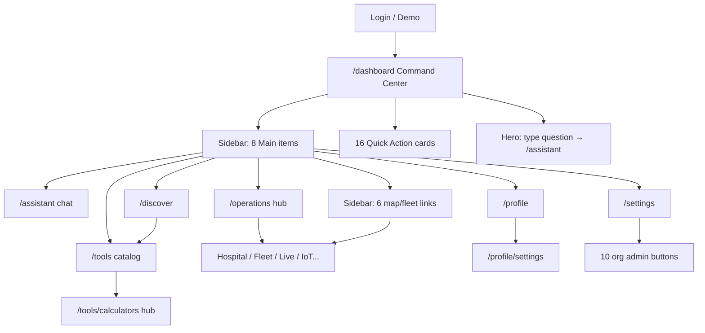

# UX Simplification Audit (New User Perspective)

**Date:** 2026-06-04  
**Scope:** Authenticated shell — Dashboard (`/dashboard`), Assistant (`/assistant`), Tools (`/tools`), Operations (`/operations`), Profile (`/profile`), Settings (`/settings`)  
**Method:** Static review of `navigation.config.js`, `Sidebar.jsx`, `AppShell.jsx`, primary pages, route map (`App.jsx`, `routes.config.js`), and cross-references to `docs/duplicate-system-audit.md` / `docs/ux-debt-report.md`.

---

## Executive verdict: 5-minute comprehension

| Area | Understand in ~5 min? | One-line reason |
|------|------------------------|-----------------|
| **Dashboard** | **Partial** | Nav says “Dashboard”; page says “Command Center” and shows 16+ launch tiles plus charts — reads as “everything,” not “start here.” |
| **Assistant** | **Partial** | Label is clear, but three entry points (sidebar item, **New Chat**, dashboard prompt) all land on the same chat without explaining when to use Tools vs chat. |
| **Tools** | **No** | Catalog scale (~200+ registry tools), 13 filters, and duplicate hubs (calculators, maps, simulation) hide the mental model “pick a tool → run it.” |
| **Operations** | **No** | Hub page exists, but sidebar still lists six map/fleet surfaces; dashboard repeats the same destinations — users cannot tell hub vs deep link. |
| **Profile** | **Partial** | Identity and activity are visible; **Profile settings** vs **App settings** vs theme on both pages splits “where do I change X?” |
| **Settings** | **Partial** | Personal prefs are buried under a long **Organization platform** button row (10+ admin links). |

**Overall:** A motivated clinician can learn **Assistant** and **Profile** basics in five minutes. They will **not** confidently distinguish **Tools vs Discover vs Automation**, or **Operations vs sidebar map items**, without extra clicks and trial-and-error. Target state: **one obvious path per job** with admin/commercial surfaces behind a single “Admin” or “Organization” entry.

---

## Recommended first-session mental model (target copy)

Use this copy consistently in nav labels, page H1s, and empty states:

| User job | Canonical place | Do *not* duplicate in |
|----------|-----------------|------------------------|
| “What should I do next?” | **Dashboard** (`/dashboard`) | 16-tile Quick Actions grid (collapse to 4–6) |
| “Ask AI / run a tool in chat” | **Assistant** (`/assistant`) | Dashboard hero form (link only) |
| “Open a specific clinical tool” | **Tools** (`/tools`, default filter **Recommended**) | Discover (merge or sub-tab) |
| “Fleet, maps, alerts, IoT” | **Operations** (`/operations`) | Operations sidebar section (hide until expanded) |
| “Who am I / my activity” | **Profile** (`/profile`) | Settings (identity only on Profile) |
| “Theme, notifications, billing, privacy” | **Settings** (`/settings`) | ProfileSettings theme/notifications (single source) |

---

## Journey map (new user, first 5 minutes)

**Unnecessary click examples**

1. Operations → Hospital Map when user already clicked **Hospital Map** in sidebar (same destination, two hierarchies).
2. Profile → **Edit settings** → `/profile/settings` for theme, then **App settings** → `/settings` for theme again.
3. Settings → **Solution packs** (`/asset-packs`) vs Organization → packs (`/settings/organization/packs`) — same capability, two URLs.
4. Dashboard notification row → **Open Notifications** link when card already links to `/notifications`.
5. Mobile: open hamburger → scroll past **Solutions** + **Operations** sections to reach Settings (no sticky “Main only” collapse).

---

## Findings by category

### 1. Confusing navigation

| ID | Severity | Evidence | User impact |
|----|----------|----------|-------------|
| NAV-01 | High | Primary nav **Dashboard** → `CommandDashboard.jsx` H1 **“CareDroid Command Center”** | User thinks they opened the wrong page. |
| NAV-02 | High | **Discover** (`/discover`) vs **Tools** (`/tools`) — both recommend tools from profile | Two “find capabilities” surfaces; Discover hidden from dashboard copy. |
| NAV-03 | High | **Automation** (`/automation` → `WorkflowAutomationBuilder`) vs **`/workflows`** (registered, not in sidebar) | “Automation” sounds like clinical workflows; second builder is undiscoverable except deep links. |
| NAV-04 | High | **Operations** nav → hub **plus** `OPERATIONS_SIDEBAR_NAV_ITEMS` (Digital Twin, Hospital Map, IoT, Devices, Fleet, Live Map) | Six peer links duplicate hub cards and dashboard Quick Actions. |
| NAV-05 | Medium | **Assistant** mobile label **“AI”** vs desktop **“Assistant”** | Inconsistent product language. |
| NAV-06 | Medium | Two workspace switchers: sidebar **Org Workspace** (`UserIdentityContext`) vs header **Care Workspace** (`workspace.config` → `/workspace/:id`) | User cannot tell org tenancy from UI “clinical workspace” preset. |
| NAV-07 | Medium | **Settings** `matchPaths` includes `/welcome`, `/onboarding` — Settings nav highlights during onboarding | Settings appears “active” while user is in hospital wizard. |
| NAV-08 | Low | **Solutions** block (Products, Specialties, Pathways, Agents) only when `FEATURE_FLAGS.commercialSurfaces` | Good gating; still adds 4 items when on — pushes Operations items below fold. |

### 2. Duplicate actions / buttons

| ID | Severity | Duplicate | Locations |
|----|----------|-----------|-----------|
| DUP-01 | High | Start chat | Sidebar **New Chat**; nav **Assistant**; dashboard hero submit → `/assistant` |
| DUP-02 | High | Open tools | Nav **Tools**; dashboard **My Tools**; Profile **Manage tools**; Quick Command (Ctrl+K) |
| DUP-03 | High | Hospital / fleet / IoT maps | `OPERATIONS_SIDEBAR_NAV_ITEMS`; `Operations.jsx` `OPERATION_AREAS`; `DASHBOARD_LAUNCH_CARDS` (8 ops-related cards) |
| DUP-04 | High | Notifications | Dashboard Notifications panel + **Open Notifications** link; nav not dedicated — user uses Settings match or dashboard |
| DUP-05 | Medium | Theme preference | `Settings.jsx` select; `ProfileSettings.jsx` `prefForm.theme`; Profile overview shows theme read-only |
| DUP-06 | Medium | Solution packs marketplace | `Settings` → `/asset-packs`; `OrganizationPages` / commercial → `/settings/organization/packs` |
| DUP-07 | Medium | Workspace entry | Dashboard **Open workspace** → `/workspaces`; header switcher → `/workspace/:id`; sidebar org workspace select |
| DUP-08 | Low | **Ask Assistant** | `Operations.jsx` hero button; dashboard prompts; empty chat actions in `Dashboard.jsx` |
| DUP-09 | Low | Sign out / account | Sidebar user chip → Profile; Profile footer 9 links including Welcome + Onboarding + Biometric |

### 3. Hidden workflows

| ID | Severity | Workflow | Why hidden |
|----|----------|----------|------------|
| HID-01 | High | **Workflow list** `/workflows` | Not in `PRIMARY_NAV_ITEMS` or Quick Command destinations list parity with Automation |
| HID-02 | High | **Tool preferences** `/profile/tool-preferences` | Only linked from dashboard “Tune my toolkit” and Profile footer — not in sidebar |
| HID-03 | Medium | **Organization admin** | Split across `/organization`, `/settings/organization/*`, `/configuration-studio`, `/onboarding` — all reachable from Settings button row only |
| HID-04 | Medium | **Calculator hub** | Many tools share `/tools/calculators`; individual calculators lack obvious breadcrumb back to Tools |
| HID-05 | Medium | **Agents registry** `/agents` | Under Solutions (flag-gated), not linked from Assistant agent picker |
| HID-06 | Low | **Quick Command** | Desktop: sidebar button; compact: header search — no onboarding tooltip on first login |
| HID-07 | Low | **Welcome** vs **Hospital onboarding** | Profile footer links both; Welcome is 3-step demo, `/onboarding` is 7-step org wizard — names collide |

### 4. Unnecessary clicks

| ID | Clicks wasted | Scenario | Fix direction |
|----|---------------|----------|---------------|
| CLK-01 | +1 | User on Operations hub wants Hospital Map — must choose hub card *or* sidebar (redundant choice) | Single ops entry; maps inside hub tabs |
| CLK-02 | +2 | Change theme: Profile → Edit settings → theme, realizes billing is under App settings | Unified **Preferences** route |
| CLK-03 | +1 | Mobile: open menu → scroll Solutions + Operations to reach Settings | Collapse non-primary sections by default |
| CLK-04 | +1 | Dashboard: scroll past hero, stats, workspace panel, adaptive panel, tool graph, then Quick Actions | Move 4–6 primary actions into hero; demote rest |
| CLK-05 | +1 | Tools default filter not “Recommended” on first visit | Set default `?filter=recommended` when no query |
| CLK-06 | +1 | Notifications: click row then panel footer link to same route | Remove duplicate footer link when list non-empty |

---

## Area-by-area notes

### Dashboard (`CommandDashboard.jsx`)

**What works:** Hero prompt → Assistant; stats row; workspace recommendations.  
**What confuses:** Page title vs nav label; **Quick Actions** grid of 16 links mirrors sidebar + Operations; `ProfileToolGraphCard` + `AdaptiveDashboardPanel` before user completes one task; technical badges on tool cards (`Calculator route`, `Backend-backed`).

### Assistant (`Dashboard.jsx` — misnamed file)

**What works:** Full chat UX, tool execution cards, conversation list in sidebar.  
**What confuses:** File/component name `Dashboard` vs route `/assistant`; relationship to **Discover** and **Tools** not explained in empty state; **New Chat** does not explain it clears/selects conversation.

### Tools (`ToolsOverview.jsx`)

**What works:** Search, asset-aware filters, recommendations when entitlement data present.  
**What confuses:** 13 filters without guidance; **All (incl. locked)** exposes paywall noise early; operations/maps tools also under Operations nav; calculator hub is a second directory.

### Operations (`Operations.jsx` + sidebar ops group)

**What works:** Hub copy (“one system”) and **Ask Assistant** CTA.  
**What confuses:** Sidebar still exposes six sub-destinations; Digital Twin vs Hospital Map vs Live Map distinction unclear; fleet paths (`/fleet/command`, etc.) not in sidebar but on hub.

### Profile (`Profile.jsx`)

**What works:** `ProfileSummaryCard`, activity/PHI sections with permission gates.  
**What confuses:** Footer link farm (9+); **Edit settings** vs **App settings**; **Request audit/export** routes to Settings not a dedicated export flow.

### Settings (`Settings.jsx`)

**What works:** Theme, notifications toggles, billing, privacy drawers.  
**What confuses:** Organization platform block looks required for all users; duplicates ProfileSettings fields; **Settings saved** toast on local-only toggles without persistence clarity.

---

## Exact fixes (implementation checklist)

Prioritized **P0** (do first for 5-minute clarity), **P1**, **P2**.

### P0 — Navigation & naming alignment

| # | Fix | File(s) | Exact change |
|---|-----|---------|--------------|
| F-01 | Align Dashboard branding | `src/pages/CommandDashboard.jsx` | Change H1 to **“Dashboard”** (or change `navigation.config.js` label to **“Command center”** — pick one string for nav, H1, and `document.title`). |
| F-02 | Rename Assistant page module | `src/pages/Dashboard.jsx` → `src/pages/AssistantPage.jsx`; update lazy import in `src/App.jsx` | Removes collision with Command Dashboard naming in code and onboarding docs. |
| F-03 | Collapse Operations sidebar | `src/config/navigation.config.js` | Set `showInSidebar: false` on all `OPERATIONS_SIDEBAR_NAV_ITEMS` **or** remove the section from `Sidebar.jsx` and rely on `/operations` only. Keep routes; add redirect hints in hub only. |
| F-04 | Reduce dashboard Quick Actions | `src/pages/CommandDashboard.jsx` | Replace `DASHBOARD_LAUNCH_CARDS` (16) with `PRIMARY_QUICK_ACTIONS` max **6**: Assistant, Tools, Calculators, Operations, Notifications, Profile. Move Digital Twin, Fleet, Hospital Map, IoT, Devices, Simulation*, Laboratory, 3D, System Status to **“More in Operations / Tools”** link → `/operations` or `/tools?filter=operations`. |
| F-05 | Default Tools filter | `src/pages/tools/ToolsOverview.jsx` | On mount when `searchParams` has no `filter`, `navigate` or set state to `recommended` (match `TOOL_FILTER_OPTIONS[0]`). |
| F-06 | Unify theme + notification prefs | `src/pages/ProfileSettings.jsx`, `src/pages/Settings.jsx` | **Option A (recommended):** ProfileSettings = identity + 2FA only; remove theme/notification fields from ProfileSettings; Profile “Edit settings” → `/settings#preferences`. **Option B:** Settings redirects theme to ProfileSettings — worse for users. |
| F-07 | Single packs URL | `src/App.jsx`, `src/pages/Settings.jsx` | Redirect `/asset-packs` → `/settings/organization/packs`; change Settings button to **Organization packs** linking only to settings path. |

### P0 — Duplicate controls

| # | Fix | File(s) | Exact change |
|---|-----|---------|--------------|
| F-08 | Clarify New Chat vs Assistant | `src/components/Sidebar.jsx` | Change button label to **“New conversation”**; add `title` tooltip: “Opens Assistant with a fresh thread.” When already on `/assistant`, call `onNewConversation` only (no navigate). |
| F-09 | Dashboard hero → Assistant | `src/pages/CommandDashboard.jsx` | Keep single prompt; remove duplicate **AI Assistant** tile from reduced Quick Actions (F-04). |
| F-10 | Remove duplicate notification CTA | `src/pages/CommandDashboard.jsx` | Delete bottom **Open Notifications** `Link` when `unreadNotifications.length > 0` (cards already navigate). Keep link only in empty state. |

### P1 — Discoverability & hidden workflows

| # | Fix | File(s) | Exact change |
|---|-----|---------|--------------|
| F-11 | Merge Discover into Tools | `src/config/navigation.config.js`, `src/App.jsx` | Remove `discover` from `PRIMARY_NAV_ITEMS`; add route redirect `/discover` → `/tools?tab=discover`. In `ToolsOverview.jsx`, add tab **Discover** rendering `CapabilityDiscovery` content or embed `buildCapabilityDiscovery` section at top. |
| F-12 | Unify automation | `src/config/navigation.config.js`, `src/App.jsx` | Rename nav label **Automation** → **Workflow builder**; add `legacyPaths: ['/workflows']`; redirect `/workflows` → `/automation` (or single tabbed page wrapping both components). |
| F-13 | First-run Quick Command hint | `src/layout/AppShell.jsx` | After first auth, `localStorage` flag `caredroid.seenQuickCommand`; show one-time `role="status"` banner: “Press Ctrl+K to search tools and pages.” |
| F-14 | Settings organization block | `src/pages/Settings.jsx` | Collapse **Organization platform** into `
` or link **“Organization admin →”** to `/settings/organization` only; remove duplicate Product/Onboarding/Outcomes buttons from default view (link from org hub). |
| F-15 | Profile footer | `src/pages/Profile.jsx` | Replace 9 inline links with **3**: Settings, Tool preferences, Security. Move Welcome, Onboarding, Biometric, Audit under Settings → **Advanced** or org admin. |
| F-16 | Workspace labeling | `src/components/Sidebar.jsx`, `src/components/WorkspaceSwitcher.jsx` | Sidebar label **“Organization”** (not “Org Workspace”); header label **“Clinical workspace”**; add one-line help in `Settings` or Profile: “Organization = tenant; Clinical workspace = UI layout preset.” |
| F-17 | Wire agents to Assistant | `src/pages/Dashboard.jsx` (Assistant) | Honor `?agent=` search param (noted in duplicate audit); empty state link **Browse agents** → `/agents`. |

### P1 — Operations & maps clarity

| # | Fix | File(s) | Exact change |
|---|-----|---------|--------------|
| F-18 | Operations hub tabs | `src/pages/Operations.jsx` | Add tab strip: **Overview | Maps & tracking | Fleet | Devices & IoT | Analytics**; map tab loads sub-routes or embedded cards — sidebar ops links removed (F-03). |
| F-19 | Map naming | `src/config/navigation.config.js`, `Operations.jsx` | Rename **Live Map** → **Tracking map**; **Fleet Map** → **Fleet overview**; add subtitles in hub cards: “Indoor hospital layout” vs “GPS fleet” vs “Combined markers.” |

### P2 — Polish & mobile

| # | Fix | File(s) | Exact change |
|---|-----|---------|--------------|
| F-20 | Sidebar sections collapsed | `src/components/Sidebar.jsx` | Default `showAdvanced=false`, add `showOperations=false` state; only **Main** expanded; Operations opens from nav **Operations** active state. |
| F-21 | Hide developer badges on dashboard tool cards | `src/pages/CommandDashboard.jsx` | Remove `launchBadgeFor` from default card UI; show in dev mode or tooltip only. |
| F-22 | Settings nav matchPaths | `src/config/navigation.config.js` | Remove `/welcome` and `/onboarding` from settings `matchPaths`; assign onboarding to no primary highlight or new **Setup** item. |
| F-23 | Mobile Assistant label | `navigation.config.js` | Set `mobileLabel: 'Assistant'` (not `AI`). |
| F-24 | Welcome vs onboarding copy | `src/pages/Welcome.jsx`, Profile links | Rename footer link **“Personal setup”** (`/welcome`); **“Organization onboarding”** (`/onboarding`). |

---

## Acceptance criteria (5-minute test script)

Run with a fresh demo account (no org admin role):

1. **0:00–1:00** — Land on `/dashboard`; user can state: “This is my home; I can ask a question here.” *(Pass after F-01, F-04, F-09.)*
2. **1:00–2:00** — Open **Assistant**; send one message; user knows chat is separate from tool list. *(Pass after F-08, F-17.)*
3. **2:00–3:00** — Open **Tools**; see ≤20 recommended tools; open one calculator. *(Pass after F-05, F-11.)*
4. **3:00–4:00** — Open **Operations**; reach hospital map in ≤2 clicks without using sidebar map links. *(Pass after F-03, F-18.)*
5. **4:00–5:00** — Change theme in **one** place; find Profile identity without opening billing. *(Pass after F-06, F-15.)*

**Pass bar:** 5/5 steps without asking “which menu?”

---

## Metrics to track post-fix

| Metric | Source |
|--------|--------|
| Median clicks from login → first tool launch | Analytics / session replay |
| % sessions with sidebar Operations sub-item click vs hub | Route analytics |
| Bounce rate on `/dashboard` without second navigation | Page analytics |
| Support-style queries: “where is X” | Manual tagging |

---

## Related audits

- `docs/duplicate-system-audit.md` — route/inventory duplicates (pack marketplace, `/workflows`, `Dashboard.jsx` naming).
- `docs/ux-debt-report.md` — automated UX debt score (88/100); calculator hub deep-linking.
- `docs/orphan-detection-report.md` — legacy redirects; do not add new alias routes without redirects.

---

## Summary

The platform is **functionally rich** but **navigation-heavy** for a first session. The largest simplification wins are: **(1)** one label for home dashboard, **(2)** one Operations entry surface, **(3)** shrink dashboard Quick Actions, **(4)** merge Discover into Tools and theme into Settings, **(5)** clarify the two workspace switchers. Implementing **F-01 through F-10** is sufficient to move the 5-minute test from **~2/5 areas clear** to **~5/5**.
