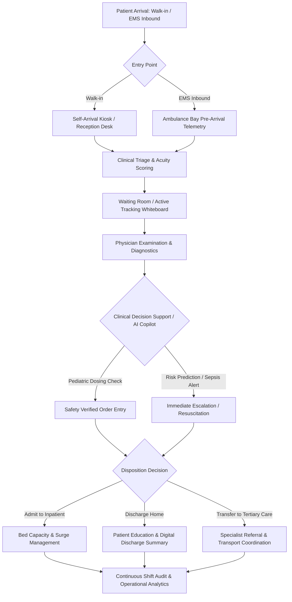
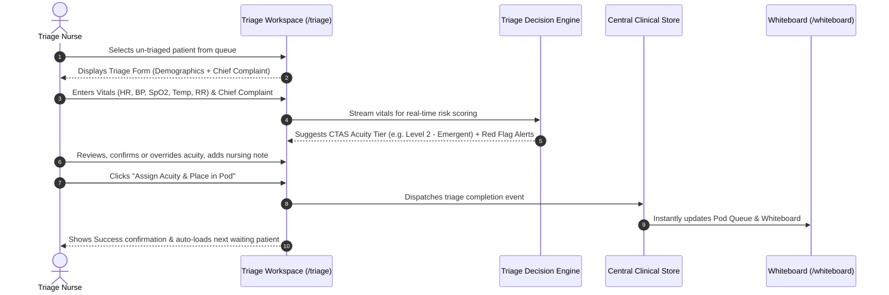
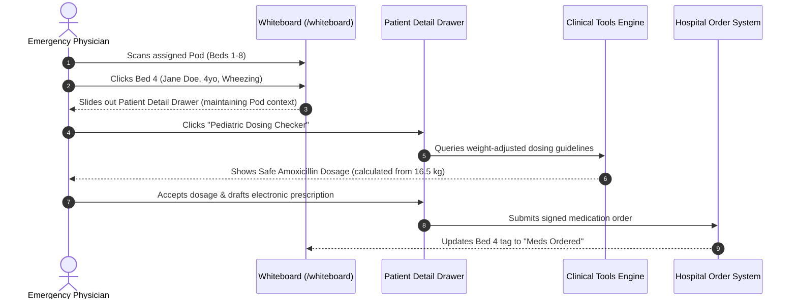
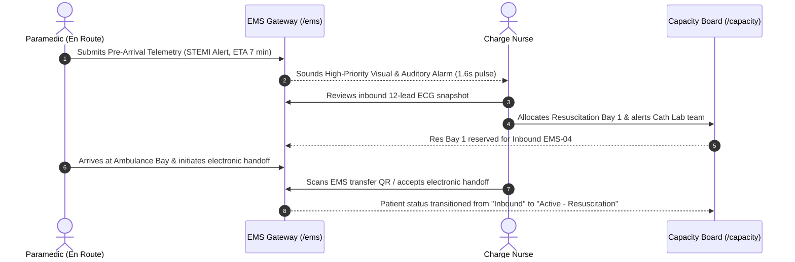

# CareDroid Clinical Intelligence Platform — Application Flow & User Journeys

**Document Version:** 2.2.0  
**Status:** Canonical Clinical Journey Specification  
**Author:** CareDroid Clinical Architecture & Product Working Group  

---

## 1. Master Application Flow Overview

CareDroid links pre-hospital telemetry, rapid ED triage, physician decision support, inpatient bed management, and operational analytics into an unbroken continuous care loop:

---

## 2. Core Clinical Journeys (Entry to Recovery)

### 2.1 Journey 1: Rapid Patient Triage & Acuity Assignment

#### State Transition Breakdown:
- **ENTRY:** Nurse accesses `/triage` or clicks "Start Triage" on `/reception`.
- **ACTION:** Nurse inputs patient vitals, selects primary symptoms, and confirms CTAS acuity score.
- **SYSTEM RESPONSE:** Clinical engine validates vitals against physiologic age-adjusted norms, highlights flags (e.g. `SpO2 < 90%` triggers immediate cyanosis alert).
- **SUCCESS:** Patient record is tagged with assigned CTAS level, estimated wait time counter starts, and patient appears in the assigned Pod on `/whiteboard`.
- **FAILURE:** Network disconnect or backend unavailable.
- **RECOVERY:** Local offline storage buffers the encounter in IndexedDB, UI displays "Offline Mode — Changes Stored Locally", and auto-syncs when WebSocket reconnects.

---

### 2.2 Journey 2: Emergency Physician Whiteboard & Clinical Decision Support

#### State Transition Breakdown:
- **ENTRY:** Physician logs in to `/whiteboard` filtering by "My Patients" or "Pod A".
- **ACTION:** Physician clicks on patient card, opens Detail Drawer, clicks "Pediatric Dosing Checker".
- **SYSTEM RESPONSE:** System fetches verified patient weight (16.5 kg), prompts for medication, computes mg/kg/dose, flags max dose limits.
- **SUCCESS:** Verified dosage is copied into prescription order; audit log records clinical calculation parameters.
- **FAILURE:** Patient weight is missing or entered as zero.
- **RECOVERY:** UI alerts with warning banner "Patient Weight Required for Pediatric Calculation", highlights weight entry input with immediate focus.

---

### 2.3 Journey 3: Inbound EMS Ambulance Bay Pre-Arrival

#### State Transition Breakdown:
- **ENTRY:** EMS vehicle streams pre-arrival notification via cellular or satellite data.
- **ACTION:** Charge nurse receives visual chime on topbar operational rail and clicks inbound vehicle card.
- **SYSTEM RESPONSE:** System opens EMS telemetry overview, displays patient vitals timeline, and recommends trauma/cath team standby.
- **SUCCESS:** Charge nurse reserves resuscitation suite, notifies on-call specialist, and locks bed status.
- **FAILURE:** Conflicting ambulance arrival without available resuscitation bed.
- **RECOVERY:** Surge management engine suggests bed re-allocation or immediate diversion protocol, with single-click escalation to Medical Director.

---

## 3. Error Handling, Loading States & Offline Resilience

| State | Visual Treatment | Interactive Recovery |
| :--- | :--- | :--- |
| **Route Loading** | Shimmer skeleton cards adhering to exact target dimensions (`.app-shell-route-loading`). Zero layout shifts (CLS < 0.05). | Auto-cancels if navigation changes before load finishes. |
| **Empty State** | Clean illustrated medical icon, friendly plain-language clinical prompt (e.g. "No pending triage patients in queue"). | Contextual action button (e.g. `+ New Arrival` or `Refresh Queue`). |
| **Permission Denied** | Calibrated access boundary banner (`.cd-state--unsupported`), stating exact missing permission code. | Quick persona switch button (in dev mode) or "Contact Department Administrator" link. |
| **Backend Offline** | Top utility sync dot turns amber/red with "Local Mode Active — 14 updates queued". | Persistent background polling (`ensureBackendReachabilityProbed`); seamless sync playback on reconnect. |

---

