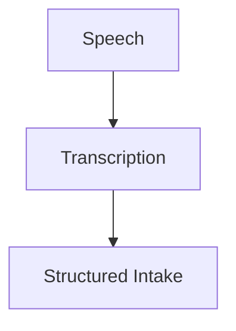

# Voice Assisted Intake

## Goal

Support conversational intake so patients or staff can answer intake questions verbally.

Voice Assisted Intake should improve accessibility by converting spoken responses into structured intake data while preserving review and correction before submission.

## Conversational Intake

The workflow should allow:

- Patients to answer intake questions verbally.
- Staff to capture patient responses verbally during assisted intake.
- Spoken responses to be transcribed into text.
- Transcribed responses to be mapped into structured intake fields.
- Unclear or incomplete responses to be flagged for follow-up.

## Conversion Flow

## Structured Intake Output

Voice Assisted Intake should convert speech into structured fields such as:

- Name.
- Date of birth.
- Address.
- Phone.
- Emergency contact.
- Complaint or reason for visit when appropriate.
- Administrative acknowledgements when supported.

The system should preserve the transcript or source reference when policy allows so reviewers can compare structured fields against the spoken response.

## Review And Correction Workflow

Require review and correction workflow.

Before spoken responses become confirmed intake data, the workflow should allow authorized users to:

- Review the transcript.
- Review the mapped structured fields.
- Correct transcription errors.
- Correct field mapping errors.
- Mark uncertain responses for follow-up.
- Confirm reviewed fields.

## Accessibility Behavior

The voice experience should support patients who have difficulty with typing, screens, kiosks, or forms.

The interface should make it clear when voice capture is active, allow staff to assist, and avoid requiring voice as the only intake path.

## Safety And Governance Boundary

Voice Assisted Intake is an intake capture layer. It does not diagnose, assign acuity, make clinical decisions, or silently finalize patient information.

Speech-derived intake fields remain proposed values until reviewed and confirmed through the correction workflow.

## Acceptance

Voice Assisted Intake is ready when:

- Patients or staff can answer intake questions verbally.
- Speech is converted into structured intake data.
- Review and correction workflow is required before confirmation.
- Accessibility improves.
